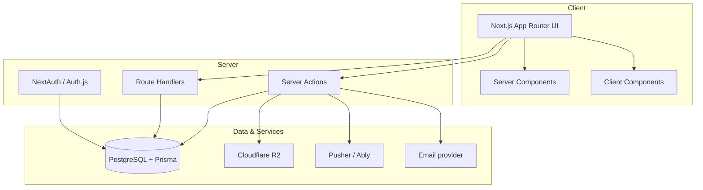

# Sport Visa - Project Plan

*Generated: 2026-05-19*
*Last Updated: 2026-05-19*

## Overview

**Project Name**: Sport Visa

**Description**: Sport Visa — პლატფორმა, რომელიც აკავშირებს ფეხბურთელებსა და კლუბებს. ფეხბურთელებს შეუძლიათ ატვირთონ სრული პროფილი (პერსონალური, ფიზიკური, კარიერული მონაცემები + ფოტო gallery), გამოიწერონ კლუბები newsfeed-ისთვის და მოითხოვონ დამატებითი სერვისები (კვება, ტრენერი, ექიმი). კლუბებს შეუძლიათ აწარმოონ პროფილი (ისტორია, შემადგენლობა, სტადიონი), ნახონ ფეხბურთელების directory ფილტრებით (პოზიცია, ასაკი, დომინანტური ფხი, გეოგრაფია, ფიზიკური მახასიათებლები) და დაუკავშირდნენ მათ real-time ჩატის საშუალებით. Tech stack: Next.js App Router + TypeScript + Tailwind + shadcn/ui, PostgreSQL + Prisma, Cloudflare R2 storage, Pusher real-time, Railway hosting. Georgian-only MVP, ხელით admin verification.

**Target Users**: ფეხბურთელები (კლუბის მაძიებლები) და ფეხბურთის კლუბები (scout-ის ფუნქცია), ასევე admin staff verification-ისა და service request-ების მართვისთვის

**Project Type**: Full-Stack Web Application

**Status**: Planning (0% complete)

---

## Architecture

### System Overview

### Role-based access

- **Footballer**: own profile CRUD, browse clubs, subscribe, chat with clubs, request services
- **Club**: own profile CRUD, browse footballers (with filters), post news, chat with footballers
- **Admin**: verification queue, moderation, services requests, reference data, user management

---

## Tech Stack

### Frontend
- **Framework**: Next.js 15 (App Router) + React 19 + TypeScript
- **Styling**: Tailwind CSS + shadcn/ui components (Radix primitives)
- **Forms**: react-hook-form + zod validation
- **State (client)**: React state + URL search params for filters
- **Design tool**: Figma (free tier) for mockups and design system spec
- **Icons**: Lucide React (open-source icon set)

### Backend
- **API**: Next.js Server Actions + Route Handlers
- **Database**: PostgreSQL 16 + Prisma ORM
- **Auth**: NextAuth (Auth.js) with Email+Password credentials provider
- **File Storage**: Cloudflare R2 (S3-compatible) with presigned URLs
- **Real-time**: Pusher / Ably (managed WebSocket)
- **Email**: Resend (transactional)

### DevOps & Infrastructure
- **Hosting**: Railway (app + PostgreSQL)
- **CI/CD**: GitHub Actions
- **Monitoring**: Sentry (errors) + structured logs
- **Secrets**: .env locally, Railway secret store in production

---

## Design Approach

Design is a first-class workstream, not a code afterthought:

1. **Brand & system** are decided before implementation (Phase 2 — wireframes, mockups, tokens, component library)
2. **Feature phases** consume the design system — each feature's UI task is implemented against pre-existing mockups + components
3. **Visual polish pass** at the end (Phase 12) audits the live product against the design source of truth and adds empty/loading/error states

---

## Testing Strategy

Testing is a parallel workstream, not a final phase. Every feature phase ends with a dedicated test task that verifies the phase's features end-to-end before downstream work begins.

- **Per-phase test tasks**: T1.10 (foundation integrations), T2.9 (design system), T3.7 (auth & onboarding), T4.8 (footballer profile), T5.7 (club profile), T6.8 (discovery), T7.8 (newsfeed & notifications), T8.6 (real-time chat), T9.5 (services), T10.6 (landing), T11.8 (admin panel)
- **Each phase test task**: unit + integration + E2E happy path for that phase's features. Adds to overall coverage. Runs on CI per PR.
- **T13.1 final aggregator**: coverage gate audit, cross-feature E2E flows, visual regression baselines for Phase 2 components + key feature screens
- **Unit tests**: Pure functions, validators, business logic (vitest). Run on every commit.
- **Integration tests**: Server Actions + DB (Testcontainers / Docker Postgres). Per-test isolated DB.
- **E2E tests**: Playwright for critical user flows.
- **Visual regression**: Component-level + page-level screenshot tests, baselined in Phase 2.
- **Coverage gate**: Minimum 70% line coverage on services; CI blocks merges below this. Verified in T13.1.
- **Acceptance criteria**: Every Medium/High task lists explicit, testable criteria. Tests turn each criterion into a check.

---

## Production Readiness Checklist

These are mandatory for shipping. The validator will flag missing items.

- [ ] Deployment pipeline configured (CI/CD)
- [ ] Environment management (.env.example, secret store)
- [ ] Logging (structured, centralized)
- [ ] Error tracking (Sentry / equivalent)
- [ ] Monitoring & uptime alerts
- [ ] Global error boundaries on the frontend
- [ ] API error handler with consistent response shape
- [ ] Rate limiting on public endpoints
- [ ] Input validation on every endpoint
- [ ] Security review (dependencies, auth, sanitization)

---

## Tasks & Implementation Plan

### Phase 1: Foundation

#### T1.1: Initialize repository and toolchain
- [ ] **Status**: TODO
- **Complexity**: Low
- **Estimated**: 2 hours
- **Dependencies**: None
- **Description**:
  - Initialize Sport Visa repo (git, .gitignore)
  - Configure TypeScript strict mode
  - Set up ESLint + Prettier with shared config
  - Add editorconfig and pre-commit hooks (lint + format)
  - Write README skeleton (setup, run, test sections)
- **Acceptance Criteria**:
  - Repo clones cleanly on a fresh machine
  - `npm install && npm run lint` succeeds
  - Pre-commit hook blocks unformatted commits

#### T1.2: Bootstrap Next.js App Router with Tailwind + shadcn/ui
- [ ] **Status**: TODO
- **Complexity**: Low
- **Estimated**: 3 hours
- **Dependencies**: T1.1
- **Description**:
  - Scaffold Next.js 15 App Router project with TypeScript
  - Install and configure Tailwind CSS
  - Initialize shadcn/ui with Georgian-friendly font (Noto Sans Georgian)
  - Set up base layout (Header / Footer / theme provider)
  - Defer brand color tokens to T2.7 (applied after brand identity decided)
- **Acceptance Criteria**:
  - App boots locally on `npm run dev`
  - shadcn/ui Button/Input/Card render correctly
  - ქართული ფონტი renders without FOUC

#### T1.3: Set up environment & secrets management
- [ ] **Status**: TODO
- **Complexity**: Low
- **Estimated**: 2 hours
- **Dependencies**: T1.1
- **Description**:
  - Create .env.example documenting every required variable
  - Add runtime env validation with zod (fail fast on boot)
  - Document local vs. CI vs. Railway secret sources
  - Add secrets to Railway (no committed secrets)
- **Acceptance Criteria**:
  - Missing env var crashes the app on boot with a clear message
  - .env is in .gitignore and never committed
  - .env.example covers every variable referenced in code

#### T1.4: Set up Prisma + PostgreSQL with initial schema scaffold
- [ ] **Status**: TODO
- **Complexity**: Medium
- **Estimated**: 4 hours
- **Dependencies**: T1.3
- **Description**:
  - Install Prisma, initialize schema with PostgreSQL provider
  - Define base User model with `role` enum (FOOTBALLER, CLUB, ADMIN)
  - Add timestamps (`createdAt`, `updatedAt`) helper convention
  - Set up Prisma Client singleton for Next.js
  - Add npm scripts for migrate, generate, studio
  - Wire local Docker Postgres for development
- **Acceptance Criteria**:
  - `npm run db:migrate` creates the schema cleanly
  - Prisma Client works in both Server Components and Server Actions
  - Local dev DB starts via docker-compose
- **Test Task**: T1.10

#### T1.5: Set up logging, error tracking, request tracing
- [ ] **Status**: TODO
- **Complexity**: Medium
- **Estimated**: 4 hours
- **Dependencies**: T1.2
- **Description**:
  - Structured logger (pino) with JSON output and request ID
  - Wire Sentry for unhandled errors (server + client)
  - Add global error.tsx and not-found.tsx
  - Standard error response shape from Route Handlers
  - Document log levels and retention
- **Acceptance Criteria**:
  - Unhandled exception in any route is captured by Sentry
  - Every server log line carries a request ID
  - Error responses follow a documented JSON shape
- **Test Task**: T1.10

#### T1.6: Integrate Cloudflare R2 for media uploads (presigned URLs)
- [ ] **Status**: TODO
- **Complexity**: Medium
- **Estimated**: 5 hours
- **Dependencies**: T1.3
- **Description**:
  - Configure R2 bucket and access keys
  - Server Action to generate presigned PUT URLs (signed for client direct upload)
  - Server-side validation: max size, mime type allowlist
  - Server Action to confirm upload (records key in DB)
  - Public read URLs (via R2 custom domain or signed GET)
- **Acceptance Criteria**:
  - Client can upload an image directly to R2 in under 2 seconds (LAN)
  - Server rejects oversized files and disallowed mime types
  - Uploaded asset is retrievable via public URL
- **Test Task**: T1.10

#### T1.7: Integrate Pusher / Ably for real-time events
- [ ] **Status**: TODO
- **Complexity**: Medium
- **Estimated**: 4 hours
- **Dependencies**: T1.3
- **Description**:
  - Set up Pusher account, configure cluster + app keys
  - Server helper to publish events with channel namespacing
  - Client hook to subscribe to channels with cleanup
  - Auth channel for private user channels (token endpoint)
  - Smoke-test channel for development
- **Acceptance Criteria**:
  - Server can publish, client receives within 1s
  - Private channel rejects unauthorized clients
- **Test Task**: T1.10

#### T1.8: Integrate Resend for transactional email
- [ ] **Status**: TODO
- **Complexity**: Low
- **Estimated**: 3 hours
- **Dependencies**: T1.3
- **Description**:
  - Set up Resend API key
  - Generic `sendEmail` helper with from address and reply-to
  - Base email template (react-email) with ქართული content support
  - Local dev mode logs emails instead of sending
- **Acceptance Criteria**:
  - Test send delivers to inbox in production env
  - Local dev never hits the live API
- **Test Task**: T1.10

#### T1.9: Set up CI pipeline (lint, type-check, unit tests)
- [ ] **Status**: TODO
- **Complexity**: Medium
- **Estimated**: 3 hours
- **Dependencies**: T1.1
- **Description**:
  - GitHub Actions workflow on PR and main
  - Steps: install, lint, type-check, unit tests
  - Cache dependencies for speed
  - Block merges on red CI
  - Add status badge to README
- **Acceptance Criteria**:
  - PR with failing tests cannot be merged
  - CI completes in under 5 minutes for the empty project

#### T1.10: Phase 1 foundation integration smoke tests
- [ ] **Status**: TODO
- **Complexity**: Medium
- **Estimated**: 4 hours
- **Dependencies**: T1.4, T1.5, T1.6, T1.7, T1.8, T1.9
- **Description**:
  - Smoke test: Prisma client connects + migration runs cleanly in CI
  - Smoke test: R2 presigned upload + read round-trip
  - Smoke test: Pusher publish from server + client receives within 1s
  - Smoke test: Resend sends in production mode, dev mode only logs
  - Smoke test: Sentry receives a forced error from a test route
  - Smoke test: Structured logger emits JSON with request ID
  - Wire all smoke tests into the CI pipeline (T1.9)
- **Acceptance Criteria**:
  - All 6 foundation integrations have a green smoke test in CI
  - Smoke suite runs in under 90 seconds
  - Broken integration fails CI with a clear error message

---

### Phase 2: Design System & Mockups

#### T2.1: Brand identity — logo, color palette, typography
- [ ] **Status**: TODO
- **Complexity**: Medium
- **Estimated**: 8 hours
- **Dependencies**: T1.1
- **Description**:
  - Design simple wordmark + icon logo (sport/football vibe, ქართული context)
  - Choose primary brand color + secondary + neutrals (light + dark mode palettes)
  - Pick typography pair: heading font + body font (ქართული support mandatory — Noto Sans Georgian or FiraGO)
  - Define type scale (h1–h6, body, caption) and spacing scale (4px base)
  - Document semantic colors (success / warning / error / info)
  - Write brand voice/tone note (formal vs. friendly, addressing footballers vs. clubs)
  - Deliverables: `design/brand.md`, `design/logo.svg`, `design/logo-icon.svg`, `design/logo-dark.svg`
- **Acceptance Criteria**:
  - Logo renders cleanly at 16px, 32px, 64px, 128px
  - Color palette has documented hex values + AA contrast ratios verified for text pairs
  - Typography pair tested with full ქართული alphabet without rendering issues
  - Brand document covers both light and dark mode
- **Test Task**: T2.9

#### T2.2: Low-fidelity wireframes for all key screens
- [ ] **Status**: TODO
- **Complexity**: Medium
- **Estimated**: 8 hours
- **Dependencies**: T2.1
- **Description**:
  - Low-fi wireframes (Figma free or Excalidraw) for 10+ key screens
  - Screens: Landing, Signup, Onboarding wizard, Footballer dashboard, Footballer profile edit, Club dashboard, Club profile edit, Footballer directory + filters, Footballer detail (club view), Club detail page, Chat thread, Services request form, Admin verification queue
  - Mobile breakpoint sketches for landing, dashboards, directory
  - User flow diagram: signup → onboarding → dashboard → core action per role
  - Annotate each screen with key interactions and data shown
  - Deliverables: `design/wireframes/*.png` + Figma link in README
- **Acceptance Criteria**:
  - All listed screens have desktop wireframes
  - Landing + both dashboards have mobile variants
  - User flow walkable from wireframes without verbal explanation
- **Test Task**: T2.9

#### T2.3: Iconography selection & custom icons
- [ ] **Status**: TODO
- **Complexity**: Low
- **Estimated**: 3 hours
- **Dependencies**: T2.1
- **Description**:
  - Adopt Lucide React as base icon set; document usage rules (size scale, stroke width, color tokens)
  - Identify custom icons needed (football positions GK/CB/CM/ST etc., dominant foot, league shields)
  - Sketch any custom icons as SVG to match Lucide stroke style
  - Document icon catalog in `design/icons.md`
- **Acceptance Criteria**:
  - Lucide tree-shaken correctly (only used icons in bundle)
  - Custom icons follow same stroke / size grid as Lucide
  - Position icons (11 main positions) drawn and exported

#### T2.4: Empty, loading, and error state illustrations
- [ ] **Status**: TODO
- **Complexity**: Low
- **Estimated**: 4 hours
- **Dependencies**: T2.1, T2.3
- **Description**:
  - Pick illustration approach: unDraw / Storyset (free) recolored to brand, OR simple SVG illustrations
  - Empty states for: footballer directory, club directory, newsfeed, chat list, services list, shortlist, notifications
  - Error states: 404 not found, 403 forbidden, 500 server error, network offline
  - Loading state pattern: skeleton blocks for cards, lists, detail pages
  - Document where each is used in `design/states.md`
- **Acceptance Criteria**:
  - 7+ empty state illustrations exported as SVG
  - 4 error state illustrations exported as SVG
  - Skeleton patterns documented for card / list / detail layouts

#### T2.5: High-fidelity mockups in Figma
- [ ] **Status**: TODO
- **Complexity**: High
- **Estimated**: 16 hours
- **Dependencies**: T2.2, T2.3, T2.4
- **Description**:
  - High-fi Figma mockups for all key screens (desktop + mobile)
  - Document interaction states: default / hover / focus / active / disabled / error / loading
  - Mobile variants for: Landing, Footballer dashboard, Club dashboard, Directory, Profile detail, Chat
  - Auto-layout used so spacing is consistent across screens
  - Share read-only Figma link in README + export key screen PNGs to `design/mockups/`
- **Acceptance Criteria**:
  - Every screen from T2.2 wireframes has a corresponding hi-fi mockup
  - Mockups use only tokens from T2.1 (no off-palette colors)
  - Interaction states documented for forms, buttons, navigation
- **Test Task**: T2.9

#### T2.6: Design system spec & component blueprint
- [ ] **Status**: TODO
- **Complexity**: Medium
- **Estimated**: 6 hours
- **Dependencies**: T2.5
- **Description**:
  - Document spec for every component: Button (primary/secondary/ghost/destructive), Input (text/textarea/select/multi-select/number/date), Card, Badge, Tabs, Dialog, Toast, Avatar, Skeleton, EmptyState, Pagination, Tooltip, DropdownMenu, Checkbox, Radio, Switch, Slider
  - Project-specific patterns: PlayerCard, ClubCard, RoleBadge (FOOTBALLER/CLUB/ADMIN), StatusPill (verification/request status), TimelineEvent, MessageBubble, FilterChip, OnboardingStep, NotificationItem
  - For each: list variants, states, sizes, do/don't usage rules, ARIA / keyboard notes
  - Deliverable: `design/design-system.md`
- **Acceptance Criteria**:
  - Every component used in mockups has a spec entry
  - Accessibility notes (focus ring, ARIA, keyboard) on every interactive component
  - 10+ project-specific composite patterns documented
- **Test Task**: T2.9

#### T2.7: Apply design tokens to Tailwind + shadcn theme
- [ ] **Status**: TODO
- **Complexity**: Medium
- **Estimated**: 4 hours
- **Dependencies**: T1.2, T2.1
- **Description**:
  - Configure tailwind.config.ts with brand color tokens (CSS variables for dark/light)
  - Update globals.css with semantic CSS vars consumed by shadcn/ui
  - Add typography utility classes matching the T2.1 type scale
  - Add spacing tokens if extending default Tailwind scale
  - Set up dark mode toggle (next-themes or shadcn ThemeProvider)
  - Document tokens in `design/tokens.md`
- **Acceptance Criteria**:
  - Existing shadcn Button/Input/Card automatically use new brand colors
  - Dark mode toggles correctly with same token system
  - No hardcoded hex colors in components (all via tokens)
- **Test Task**: T2.9

#### T2.8: Build extended component library in code
- [ ] **Status**: TODO
- **Complexity**: High
- **Estimated**: 16 hours
- **Dependencies**: T2.6, T2.7
- **Description**:
  - Install / customize all shadcn primitives identified in T2.6
  - Build project-specific composite components: PlayerCard, ClubCard, RoleBadge, StatusPill, TimelineEvent, MessageBubble, FilterChip, OnboardingStep, NotificationItem, EmptyState, ErrorState, SkeletonCard, SkeletonList, SkeletonDetail, PageHeader, SidebarNav
  - Each component fully typed with TypeScript props
  - Add a /design-system playground route (dev-only) that renders every component with all variants & states
  - Storybook optional — playground route is the MVP requirement
  - Document props in JSDoc comments
- **Acceptance Criteria**:
  - Every component in T2.6 has a code implementation
  - /design-system playground renders all variants without errors
  - Components respect dark mode via tokens (no light-only assumptions)
  - All interactive components keyboard-accessible (tab order + Enter/Space)
- **Test Task**: T2.9

#### T2.9: Phase 2 design system component tests
- [ ] **Status**: TODO
- **Complexity**: Medium
- **Estimated**: 8 hours
- **Dependencies**: T2.8
- **Description**:
  - Unit tests for stateful components (StatusPill by status, RoleBadge by role, OnboardingStep step transitions)
  - Snapshot tests for every component variant on the /design-system playground
  - Visual regression baseline via Playwright screenshot — light + dark mode
  - Accessibility audit on /design-system using axe-core (keyboard nav, ARIA, focus rings)
  - Token contract test — fail CI if a hardcoded hex color appears in component code
- **Acceptance Criteria**:
  - Every Phase 2 composite component has ≥1 unit test
  - Playwright visual baseline captured for all components (both themes)
  - 0 critical axe issues on /design-system route
  - Hardcoded-hex scanner part of CI pipeline

---

### Phase 3: Authentication & Onboarding

#### T3.1: Design Prisma User + Profile relations and migrations
- [ ] **Status**: TODO
- **Complexity**: Medium
- **Estimated**: 4 hours
- **Dependencies**: T1.4
- **Description**:
  - User: id, email (unique), passwordHash, role, emailVerified, verifiedAt (admin), status
  - One-to-one User → PlayerProfile (nullable) and User → ClubProfile (nullable)
  - Indexes on email, role, verifiedAt
  - Migration generated and committed
- **Acceptance Criteria**:
  - `prisma migrate` runs cleanly
  - A user cannot have both PlayerProfile and ClubProfile in invariant
  - Tests cover unique constraints
- **Test Task**: T3.7

#### T3.2: Implement Email+Password auth with NextAuth (Auth.js)
- [ ] **Status**: TODO
- **Complexity**: High
- **Estimated**: 8 hours
- **Dependencies**: T3.1, T2.8
- **Description**:
  - Install Auth.js v5 with Credentials provider
  - Argon2id password hashing
  - JWT session strategy with role + verifiedAt claims
  - Rate limiting on login attempts (per IP + per email)
  - Login + Register Server Actions with zod validation
  - Login + Register UI built from Phase 2 components (Input, Button, Card, EmptyState)
- **Acceptance Criteria**:
  - Successful login establishes a session and redirects to role dashboard
  - Failed login returns a generic error (no user enumeration)
  - Brute force is blocked after N attempts
  - UI matches T2.5 mockups for login/register screens
- **Test Task**: T3.7

#### T3.3: Email verification flow
- [ ] **Status**: TODO
- **Complexity**: Medium
- **Estimated**: 5 hours
- **Dependencies**: T3.2, T1.8
- **Description**:
  - Generate signed token on signup
  - Send verification email via Resend
  - Verification endpoint marks emailVerified=true
  - UI: "Check your email" + resend button (with cooldown)
- **Acceptance Criteria**:
  - User cannot access role dashboard until email verified
  - Expired tokens return a clear error
  - Resend respects 60s cooldown
- **Test Task**: T3.7

#### T3.4: Password reset flow
- [ ] **Status**: TODO
- **Complexity**: Medium
- **Estimated**: 5 hours
- **Dependencies**: T3.2, T1.8
- **Description**:
  - "Forgot password" form
  - Signed reset token email
  - Reset password page with new password input + confirmation
  - Invalidate all sessions on password change
- **Acceptance Criteria**:
  - Token is single-use and expires in 1 hour
  - All active sessions are revoked after reset
  - Same generic response whether email exists or not (no enumeration)
- **Test Task**: T3.7

#### T3.5: Role-based middleware and dashboard routing
- [ ] **Status**: TODO
- **Complexity**: Medium
- **Estimated**: 4 hours
- **Dependencies**: T3.2
- **Description**:
  - middleware.ts gates `/dashboard/player`, `/dashboard/club`, `/admin`
  - Unverified users routed to `/verify-email`
  - Unverified-by-admin clubs/players routed to "Pending verification" page
  - Role mismatch returns 403
- **Acceptance Criteria**:
  - A FOOTBALLER hitting `/dashboard/club` is denied
  - Unverified user cannot reach any dashboard route
  - Admin-only routes guarded everywhere they appear
- **Test Task**: T3.7

#### T3.6: Onboarding wizard — role selection + minimal profile
- [ ] **Status**: TODO
- **Complexity**: Medium
- **Estimated**: 6 hours
- **Dependencies**: T3.5, T2.8
- **Description**:
  - Multi-step form (role pick → basics → submit) using OnboardingStep component from T2.8
  - Persists draft between steps (localStorage)
  - Footballer minimum: name, DOB, position
  - Club minimum: name, founded year, city
  - On finish, creates PlayerProfile or ClubProfile and routes to dashboard
- **Acceptance Criteria**:
  - User can complete onboarding in under 2 minutes
  - Refreshing mid-step restores progress
  - Invalid inputs block the Next button
  - UI matches T2.5 mockups for onboarding flow
- **Test Task**: T3.7

#### T3.7: Phase 3 authentication & onboarding tests
- [ ] **Status**: TODO
- **Complexity**: High
- **Estimated**: 10 hours
- **Dependencies**: T3.2, T3.3, T3.4, T3.5, T3.6
- **Description**:
  - Unit tests for password hashing, JWT claim shaping, signed-token generation, rate limiter
  - Integration tests against Postgres for User CRUD, session creation, role transitions, unique constraints
  - E2E happy path (Playwright): signup → email verify → onboarding wizard → role dashboard for both roles
  - E2E edge cases: invalid email, expired verification token, password reset, role-mismatch redirect, unverified user blocked from dashboard
  - Rate limiter assertion under simulated burst
  - User-enumeration safety: identical responses for known vs. unknown emails
- **Acceptance Criteria**:
  - Auth happy paths for both roles green E2E
  - All error paths (expired, invalid, unauthorized) covered
  - ≥70% coverage on auth service files
  - Rate limiter triggers 429 under load test

---

### Phase 4: Footballer Profile & Dashboard

#### T4.1: Prisma PlayerProfile schema (basic + physical + career)
- [ ] **Status**: TODO
- **Complexity**: Medium
- **Estimated**: 4 hours
- **Dependencies**: T3.1
- **Description**:
  - PlayerProfile: firstName, lastName, dob, nationality, city, region, photoKey
  - Physical: heightCm, weightKg, position enum, secondaryPositions[], dominantFoot enum
  - Career history: PlayerCareerEntry (clubName, fromYear, toYear, role)
  - Agent info: agentName, agentContact
  - Migration committed
- **Acceptance Criteria**:
  - Schema validates with zod mirror on the app side
  - Enums for position and dominantFoot match the spec
- **Test Task**: T4.8

#### T4.2: Footballer dashboard shell + sidebar navigation
- [ ] **Status**: TODO
- **Complexity**: Low
- **Estimated**: 3 hours
- **Dependencies**: T3.5, T2.8
- **Description**:
  - Layout using SidebarNav from T2.8 (Profile / Clubs / Subscriptions / Chat / Services)
  - Top bar with user menu + notifications icon
  - Responsive collapse to a mobile drawer per T2.5 mockups

#### T4.3: Profile edit — basic info form
- [ ] **Status**: TODO
- **Complexity**: Medium
- **Estimated**: 5 hours
- **Dependencies**: T4.1, T4.2, T1.6
- **Description**:
  - Form: first/last name, DOB, nationality, city, region
  - Profile photo upload (R2 presigned URL flow)
  - Inline validation with zod + react-hook-form
  - Save action is idempotent
- **Acceptance Criteria**:
  - All fields persist correctly
  - Photo upload < 5MB, jpg/png/webp only
  - Validation errors render adjacent to each field
- **Test Task**: T4.8

#### T4.4: Profile edit — physical attributes form
- [ ] **Status**: TODO
- **Complexity**: Medium
- **Estimated**: 4 hours
- **Dependencies**: T4.3
- **Description**:
  - Height (cm) and weight (kg) numeric inputs with bounds
  - Primary position dropdown + secondary positions multi-select
  - Dominant foot radio (Left / Right / Both)
- **Acceptance Criteria**:
  - Heights outside 140-220cm rejected
  - At least primary position required
- **Test Task**: T4.8

#### T4.5: Profile edit — career history & agent info
- [ ] **Status**: TODO
- **Complexity**: Medium
- **Estimated**: 5 hours
- **Dependencies**: T4.3
- **Description**:
  - Add / edit / delete career entries using TimelineEvent component from T2.8
  - Field set: club name (free text for MVP), fromYear, toYear (nullable=current), role
  - Agent info: name + contact (optional)
  - Sortable by date desc
- **Acceptance Criteria**:
  - Overlapping entries flagged with a warning (not blocked)
  - toYear blank means "current" and renders accordingly
- **Test Task**: T4.8

#### T4.6: Photo gallery — upload, reorder, delete
- [ ] **Status**: TODO
- **Complexity**: Medium
- **Estimated**: 6 hours
- **Dependencies**: T4.3
- **Description**:
  - PlayerMedia model with order index
  - Multi-upload UI (drag drop) with optimistic previews
  - Reorder by drag, delete with confirmation
  - Max 20 photos per profile
- **Acceptance Criteria**:
  - Order persists after refresh
  - Deleting an image removes the R2 object as well
  - Upload errors show inline retry
- **Test Task**: T4.8

#### T4.7: Footballer's own profile preview ("how clubs see me")
- [ ] **Status**: TODO
- **Complexity**: Low
- **Estimated**: 3 hours
- **Dependencies**: T4.3, T4.4, T4.5, T4.6
- **Description**:
  - Read-only render of the public-club view
  - Banner with completion percentage
  - "Edit" deep links into each section
- **Acceptance Criteria**:
  - Empty fields show clear placeholders

#### T4.8: Phase 4 footballer profile tests
- [ ] **Status**: TODO
- **Complexity**: Medium
- **Estimated**: 8 hours
- **Dependencies**: T4.3, T4.4, T4.5, T4.6, T4.7
- **Description**:
  - Unit tests for profile validation (height/weight bounds, position enum, dominant foot)
  - Integration tests for PlayerProfile + PlayerCareerEntry + PlayerMedia CRUD via Server Actions
  - R2 upload tests with mocked presigned URLs (success + retry + size/mime rejection)
  - Career history overlap-warning logic tested
  - Photo gallery reorder + delete (R2 object cleanup verified)
  - E2E (Playwright): footballer logs in → edits basic + physical + career → uploads 3 photos → reorders → opens preview
  - Completion percentage calculation tested for partial profiles
- **Acceptance Criteria**:
  - All profile field validation paths tested
  - Gallery reorder + delete + R2 cleanup tested
  - E2E green for full profile-edit flow
  - ≥70% coverage on player profile services

---

### Phase 5: Club Profile & Dashboard

#### T5.1: Prisma ClubProfile + ClubHistoryEvent + TeamRoster schema
- [ ] **Status**: TODO
- **Complexity**: Medium
- **Estimated**: 4 hours
- **Dependencies**: T3.1
- **Description**:
  - ClubProfile: name, logoKey, bannerKey, foundedYear, stadiumName, leagueId, city, region, contactEmail, contactPhone, socialLinks JSON
  - ClubHistoryEvent: clubId, year, title, body
  - TeamRosterMember: clubId, playerId (nullable for free-text members), displayName, position, jerseyNumber
  - League reference table (admin-managed)
- **Acceptance Criteria**:
  - Linking a registered player establishes a relation
  - Free-text roster member allowed when player is not on platform
- **Test Task**: T5.7

#### T5.2: Club dashboard shell + sidebar navigation
- [ ] **Status**: TODO
- **Complexity**: Low
- **Estimated**: 3 hours
- **Dependencies**: T3.5, T2.8
- **Description**:
  - Sidebar via SidebarNav from T2.8 (Profile / History / Team / Footballers / Newsfeed / Chat / Services)
  - Top bar with user menu + notifications
  - Layout follows T2.5 club dashboard mockup

#### T5.3: Club profile edit — basic info + branding
- [ ] **Status**: TODO
- **Complexity**: Medium
- **Estimated**: 6 hours
- **Dependencies**: T5.1, T5.2, T1.6
- **Description**:
  - Name, founded year, stadium, city, region, league select
  - Logo upload + banner upload (R2)
  - Contact info: email, phone, social links (Facebook, Instagram, YouTube, X)
- **Acceptance Criteria**:
  - Logo resized via Next/Image with multiple sizes
  - Invalid social URLs flagged inline
  - League dropdown shows admin-managed list
- **Test Task**: T5.7

#### T5.4: Club history timeline editor
- [ ] **Status**: TODO
- **Complexity**: Medium
- **Estimated**: 5 hours
- **Dependencies**: T5.3
- **Description**:
  - Add / edit / delete history events using TimelineEvent from T2.8
  - Sortable by year desc
  - Rich-text body (basic markdown subset)
- **Acceptance Criteria**:
  - Events with no year rejected
  - Timeline renders chronologically on the public club page
- **Test Task**: T5.7

#### T5.5: Team roster management
- [ ] **Status**: TODO
- **Complexity**: High
- **Estimated**: 8 hours
- **Dependencies**: T5.3
- **Description**:
  - Add roster member: search registered footballers OR enter free text
  - Position dropdown + jersey number
  - Bulk reorder by drag
  - Pending invite flow when adding a registered player (player confirms link)
- **Acceptance Criteria**:
  - Linked players show "Verified" badge on roster
  - Removing a member doesn't delete the underlying player
  - Pending invites can be cancelled by either side
- **Test Task**: T5.7

#### T5.6: Club's own public profile preview
- [ ] **Status**: TODO
- **Complexity**: Low
- **Estimated**: 3 hours
- **Dependencies**: T5.3, T5.4, T5.5
- **Description**:
  - Read-only render matching the public club page
  - Completion percentage banner

#### T5.7: Phase 5 club profile tests
- [ ] **Status**: TODO
- **Complexity**: Medium
- **Estimated**: 8 hours
- **Dependencies**: T5.3, T5.4, T5.5, T5.6
- **Description**:
  - Unit tests for social URL validation, league reference integrity, jersey-number uniqueness within club
  - Integration tests for ClubProfile + ClubHistoryEvent + TeamRosterMember CRUD
  - Linked-player invite flow tested: send → accept → reject → cancel paths
  - R2 logo/banner upload mocked + tested for multi-size resize
  - E2E (Playwright): club logs in → edits profile → adds 3 history events → adds 5 roster members (mix linked + free text) → previews
  - Negative test: removing a roster member does NOT delete the underlying PlayerProfile
- **Acceptance Criteria**:
  - Linked-player invite state machine fully covered (4 path tests)
  - History timeline CRUD tested
  - E2E green for full club setup flow
  - ≥70% coverage on club profile services

---

### Phase 6: Discovery & Filtering

#### T6.1: Footballer directory page (clubs-only access)
- [ ] **Status**: TODO
- **Complexity**: Medium
- **Estimated**: 5 hours
- **Dependencies**: T4.1, T3.5, T2.8
- **Description**:
  - Server-rendered list with pagination (cursor or page-based)
  - PlayerCard from T2.8 in a responsive grid
  - Middleware gates the route to CLUB role + verified
  - URL search params drive filter state
- **Acceptance Criteria**:
  - FOOTBALLER hitting this route is redirected
  - 50 results per page, < 500ms server time
- **Test Task**: T6.8

#### T6.2: Filters — position, age range, dominant foot
- [ ] **Status**: TODO
- **Complexity**: Medium
- **Estimated**: 5 hours
- **Dependencies**: T6.1
- **Description**:
  - Sidebar filter panel synced to URL params
  - FilterChip from T2.8 shown for applied filters
  - Multi-select position, age range slider, foot radio
  - "Clear all" + applied-filter chips
- **Acceptance Criteria**:
  - Filter combination reflected in DB query
  - Empty result state with friendly copy + EmptyState component
- **Test Task**: T6.8

#### T6.3: Filters — geography + physical attributes
- [ ] **Status**: TODO
- **Complexity**: Medium
- **Estimated**: 5 hours
- **Dependencies**: T6.2
- **Description**:
  - Region + city dropdowns (cascading)
  - Height range, weight range sliders
  - Combine with Phase-6 filters
- **Acceptance Criteria**:
  - Range filters use indexed columns (verify EXPLAIN plan)
- **Test Task**: T6.8

#### T6.4: Footballer detail page (club view)
- [ ] **Status**: TODO
- **Complexity**: Medium
- **Estimated**: 5 hours
- **Dependencies**: T4.7, T6.1
- **Description**:
  - Full profile render: basics, physical, career, gallery
  - "Start chat" button (deep links to Phase 8)
  - "Save to shortlist" (T6.7)
- **Acceptance Criteria**:
  - Page accessible only to verified clubs
  - Footballer's contact details are not exposed
- **Test Task**: T6.8

#### T6.5: Club directory page (public + auth aware)
- [ ] **Status**: TODO
- **Complexity**: Medium
- **Estimated**: 4 hours
- **Dependencies**: T5.1, T2.8
- **Description**:
  - Public card grid using ClubCard from T2.8 (logo, name, league, city)
  - Search by name + filter by league/region
  - Pagination
- **Acceptance Criteria**:
  - Anonymous users can browse but not subscribe
- **Test Task**: T6.8

#### T6.6: Club detail page with team roster + history
- [ ] **Status**: TODO
- **Complexity**: Medium
- **Estimated**: 5 hours
- **Dependencies**: T6.5, T5.4, T5.5
- **Description**:
  - Hero with banner + logo
  - Tabs: Overview / History / Team / News (Tabs from T2.8)
  - Subscribe button (auth-gated to footballers)
- **Acceptance Criteria**:
  - Subscribed state reflected immediately (optimistic UI)
- **Test Task**: T6.8

#### T6.7: Clubs' footballer shortlist
- [ ] **Status**: TODO
- **Complexity**: Low
- **Estimated**: 3 hours
- **Dependencies**: T6.4
- **Description**:
  - Save / unsave from directory and detail pages
  - "My shortlist" page filtered by saved
- **Acceptance Criteria**:
  - State persists across sessions

#### T6.8: Phase 6 discovery & filtering tests
- [ ] **Status**: TODO
- **Complexity**: Medium
- **Estimated**: 8 hours
- **Dependencies**: T6.1, T6.2, T6.3, T6.4, T6.5, T6.6, T6.7
- **Description**:
  - Integration tests for filter query composition (position + age + foot + geo + physical) — verify each filter narrows results correctly
  - Access control: FOOTBALLER attempting /directory/footballers returns 403 / redirect
  - Footballer detail page: contact info NOT exposed in response payload
  - Performance: directory loads < 500ms server time with 100 seeded players (assert via test)
  - E2E (Playwright): club logs in → opens directory → applies all 5 filter dimensions → filter chips reflect state → opens detail → saves to shortlist → returns to shortlist page
  - Shortlist persistence across sessions (login → save → logout → login → still saved)
- **Acceptance Criteria**:
  - All filter dimensions return correct subsets
  - Role-based access enforced via negative tests
  - Shortlist persistence verified across two sessions
  - Performance budget asserted in CI

---

### Phase 7: Subscriptions, Newsfeed & Notifications

#### T7.1: Prisma Subscription + Post + Notification schema
- [ ] **Status**: TODO
- **Complexity**: Medium
- **Estimated**: 4 hours
- **Dependencies**: T3.1, T5.1
- **Description**:
  - Subscription(footballerUserId, clubId, createdAt)
  - Post(clubId, body, mediaKeys[], createdAt)
  - Notification(userId, kind, payload JSON, readAt nullable)
  - Indexes for feed queries
- **Acceptance Criteria**:
  - Feed query (subscribed clubs' posts, latest 50) runs < 200ms
- **Test Task**: T7.8

#### T7.2: Club post composer (CRUD)
- [ ] **Status**: TODO
- **Complexity**: Medium
- **Estimated**: 5 hours
- **Dependencies**: T7.1, T1.6
- **Description**:
  - Composer with text + optional images (R2)
  - Edit + delete own posts
  - Drafts (localStorage)
- **Acceptance Criteria**:
  - Markdown rendered safely (no XSS)
  - Image limit per post = 4
- **Test Task**: T7.8

#### T7.3: Subscribe / unsubscribe to club action
- [ ] **Status**: TODO
- **Complexity**: Low
- **Estimated**: 2 hours
- **Dependencies**: T7.1, T6.6
- **Description**:
  - Server Action toggles subscription
  - Optimistic UI on the button
- **Acceptance Criteria**:
  - Double-click does not create duplicate rows

#### T7.4: Newsfeed page (aggregated subscribed clubs)
- [ ] **Status**: TODO
- **Complexity**: Medium
- **Estimated**: 5 hours
- **Dependencies**: T7.2, T7.3, T2.8
- **Description**:
  - Reverse-chronological feed for the footballer
  - Infinite scroll
  - Per-post club header (logo + name + posted-at)
  - EmptyState shown when no subscriptions
- **Acceptance Criteria**:
  - Empty state: "Subscribe to clubs to see news"
- **Test Task**: T7.8

#### T7.5: In-app notification dropdown + page
- [ ] **Status**: TODO
- **Complexity**: Medium
- **Estimated**: 5 hours
- **Dependencies**: T7.1, T1.7, T2.8
- **Description**:
  - Bell icon with unread count
  - Dropdown with latest 10 (NotificationItem from T2.8)
  - Full notifications page with pagination
  - Real-time updates via Pusher private channel
- **Acceptance Criteria**:
  - New notification arrives within 1s of trigger
  - Mark-as-read updates the badge instantly
- **Test Task**: T7.8

#### T7.6: Email notifications (instant + daily digest)
- [ ] **Status**: TODO
- **Complexity**: Medium
- **Estimated**: 5 hours
- **Dependencies**: T7.5, T1.8
- **Description**:
  - Instant for direct events (chat, verification, service request status)
  - Daily digest for newsfeed (one per day max)
  - Templates with footer unsubscribe link
- **Acceptance Criteria**:
  - User can disable digest from preferences
  - Unsubscribe link works without login
- **Test Task**: T7.8

#### T7.7: Notification preferences page
- [ ] **Status**: TODO
- **Complexity**: Low
- **Estimated**: 3 hours
- **Dependencies**: T7.6
- **Description**:
  - Toggle per notification kind (in-app + email)
  - Defaults documented

#### T7.8: Phase 7 subscriptions & notifications tests
- [ ] **Status**: TODO
- **Complexity**: Medium
- **Estimated**: 8 hours
- **Dependencies**: T7.2, T7.3, T7.4, T7.5, T7.6, T7.7
- **Description**:
  - Integration tests for Subscribe action idempotency (double-click no-duplicate)
  - Post CRUD + Markdown XSS-safety (try injection payloads)
  - Feed aggregation query benchmark < 200ms with 50 subs × 10 posts
  - Mock Pusher channel publish + receipt < 1s
  - Mock Resend: instant fires for direct events; daily digest deduplicates within 24h window
  - Unsubscribe link works WITHOUT logged-in session
  - Notification preferences: toggling off disables both in-app and email per kind
  - E2E (Playwright): footballer subscribes to club → club composes a post → newsfeed updates → in-app bell badge increments → email digest queued (in test mode)
- **Acceptance Criteria**:
  - Feed query benchmarked under budget
  - No XSS in post bodies (sanitizer tested with 5 attack vectors)
  - Unsubscribe flow works for both authenticated and unauthenticated users
  - ≥70% coverage on subscription + notification services

---

### Phase 8: Real-time Chat

#### T8.1: Prisma Conversation + Message schema
- [ ] **Status**: TODO
- **Complexity**: Medium
- **Estimated**: 4 hours
- **Dependencies**: T3.1
- **Description**:
  - Conversation(participantA, participantB, lastMessageAt)
  - Unique constraint on the (a, b) pair regardless of order
  - Message(conversationId, senderId, body, createdAt, readAt nullable)
  - Indexes for latest-messages queries
- **Acceptance Criteria**:
  - Cannot create two conversations for the same pair
- **Test Task**: T8.6

#### T8.2: Conversation list page
- [ ] **Status**: TODO
- **Complexity**: Medium
- **Estimated**: 4 hours
- **Dependencies**: T8.1, T2.8
- **Description**:
  - Left rail with conversation previews
  - Unread badge per conversation
  - Sorted by lastMessageAt desc
  - EmptyState when no conversations
- **Acceptance Criteria**:
  - Empty state: "Start a chat from a profile"
- **Test Task**: T8.6

#### T8.3: Conversation thread view with send
- [ ] **Status**: TODO
- **Complexity**: High
- **Estimated**: 8 hours
- **Dependencies**: T8.2, T1.7, T2.8
- **Description**:
  - Message list with day separators (MessageBubble from T2.8)
  - Composer with Enter-to-send
  - Optimistic append on send
  - Server Action persists, publishes Pusher event to receiver
- **Acceptance Criteria**:
  - Message delivered to receiver within 1s
  - Failed sends show inline retry
  - Server enforces sender is a participant
- **Test Task**: T8.6

#### T8.4: Read receipts + unread counters
- [ ] **Status**: TODO
- **Complexity**: Medium
- **Estimated**: 4 hours
- **Dependencies**: T8.3
- **Description**:
  - Mark-as-read on view (debounced)
  - Sender sees "read" indicator
  - Unread badge in top bar
- **Acceptance Criteria**:
  - Badge updates without page reload
- **Test Task**: T8.6

#### T8.5: "Start chat" from profile pages
- [ ] **Status**: TODO
- **Complexity**: Low
- **Estimated**: 2 hours
- **Dependencies**: T8.3
- **Description**:
  - Button creates conversation if it doesn't exist, routes to thread
- **Acceptance Criteria**:
  - Re-clicking the button reuses the existing conversation

#### T8.6: Phase 8 real-time chat tests
- [ ] **Status**: TODO
- **Complexity**: High
- **Estimated**: 8 hours
- **Dependencies**: T8.2, T8.3, T8.4, T8.5
- **Description**:
  - Unit tests for participant guard (only A or B can send/read)
  - Integration test: creating a conversation for an existing (a,b) pair returns the existing record, not a new one (idempotency)
  - Pusher private channel auth: unauthorized client rejected (403)
  - E2E (Playwright with 2 browser contexts): footballer + club exchange messages, read receipt fires within 1s, unread badge updates
  - Concurrency test: A and B send simultaneously, both messages persist in correct order
  - Failure path: simulated Pusher outage triggers optimistic UI rollback + inline retry button
  - "Start chat" idempotency: re-clicking opens same conversation, not a new one
- **Acceptance Criteria**:
  - Receipt < 1s in two-context E2E
  - Cannot create duplicate conversation for same pair
  - Unauthorized read attempt returns 403
  - Optimistic retry path tested

---

### Phase 9: Services Request System

#### T9.1: Prisma ServiceCategory + ServiceRequest schema
- [ ] **Status**: TODO
- **Complexity**: Medium
- **Estimated**: 4 hours
- **Dependencies**: T3.1
- **Description**:
  - ServiceCategory(name, slug, description, active) — admin-managed
  - ServiceRequest(userId, categoryId, message, status enum, adminNote, createdAt, updatedAt)
  - Status enum: PENDING, IN_REVIEW, APPROVED, REJECTED, FULFILLED
- **Acceptance Criteria**:
  - Inactive categories hidden from users but visible to admin
- **Test Task**: T9.5

#### T9.2: Service categories listing page
- [ ] **Status**: TODO
- **Complexity**: Low
- **Estimated**: 2 hours
- **Dependencies**: T9.1, T2.8
- **Description**:
  - Cards: კვება, ტრენერი, ექიმი, etc. (Card + brand icons from Phase 2)
  - CTA: "მოთხოვნის გაგზავნა"

#### T9.3: Service request form + submission
- [ ] **Status**: TODO
- **Complexity**: Medium
- **Estimated**: 4 hours
- **Dependencies**: T9.2
- **Description**:
  - Category context (preselected)
  - Message textarea (min 30 / max 1000 chars)
  - Optional attachments (R2)
  - On submit, notify admin
- **Acceptance Criteria**:
  - Confirmation page with request ID
  - Admin receives in-app + email notification
- **Test Task**: T9.5

#### T9.4: User's "My requests" page
- [ ] **Status**: TODO
- **Complexity**: Low
- **Estimated**: 3 hours
- **Dependencies**: T9.3, T2.8
- **Description**:
  - List of own requests using StatusPill from T2.8
  - Detail page with admin note
- **Acceptance Criteria**:
  - Status changes reflected in real-time (Pusher)

#### T9.5: Phase 9 service requests tests
- [ ] **Status**: TODO
- **Complexity**: Low
- **Estimated**: 5 hours
- **Dependencies**: T9.2, T9.3, T9.4
- **Description**:
  - Unit tests for status transition graph (REJECTED is terminal, FULFILLED is terminal, allowed transitions enforced)
  - Integration tests for request submission + admin notification fan-out (in-app + email)
  - Inactive categories hidden from user listing but visible to admin
  - Message length bounds validated (min 30 / max 1000 chars)
  - E2E (Playwright): user picks category → submits with attachment → sees confirmation with request ID → admin receives notification → admin updates status → user sees real-time status change via Pusher
- **Acceptance Criteria**:
  - Invalid status transitions rejected (e.g., REJECTED → APPROVED returns error)
  - Notification fan-out verified for in-app + email
  - User's "My requests" reflects status updates within 1s (Pusher path)

---

### Phase 10: Public Landing Page

#### T10.1: Landing layout + Hero section
- [ ] **Status**: TODO
- **Complexity**: Medium
- **Estimated**: 5 hours
- **Dependencies**: T1.2, T2.8
- **Description**:
  - Full-width hero with headline, sub, two CTAs (footballer signup, club signup)
  - Hero illustration / video
  - Mobile-first responsive
  - Matches T2.5 landing mockup
- **Acceptance Criteria**:
  - Lighthouse performance ≥ 90 on mobile
  - LCP < 2.5s on cold cache
- **Test Task**: T10.6

#### T10.2: Features grid section
- [ ] **Status**: TODO
- **Complexity**: Low
- **Estimated**: 3 hours
- **Dependencies**: T10.1
- **Description**:
  - 6 cards with icons + short copy (icons from T2.3)
  - Animate on scroll (subtle)

#### T10.3: "How it works" section
- [ ] **Status**: TODO
- **Complexity**: Low
- **Estimated**: 3 hours
- **Dependencies**: T10.1
- **Description**:
  - 3 steps for footballers, 3 steps for clubs (tabbed)
  - Each step: icon + headline + 1 sentence

#### T10.4: Testimonials + FAQ + Contact sections
- [ ] **Status**: TODO
- **Complexity**: Medium
- **Estimated**: 5 hours
- **Dependencies**: T10.1
- **Description**:
  - Testimonials carousel (3-5 quotes)
  - FAQ accordion (8-12 items) — uses Tabs / Accordion from T2.8
  - Contact form (sends email to admin via T1.8)
- **Acceptance Criteria**:
  - Contact form has anti-spam (honeypot + rate limit)
- **Test Task**: T10.6

#### T10.5: SEO, OpenGraph, robots.txt, sitemap
- [ ] **Status**: TODO
- **Complexity**: Low
- **Estimated**: 3 hours
- **Dependencies**: T10.4
- **Description**:
  - Meta tags for title/description/og:image
  - sitemap.xml (landing + public clubs)
  - robots.txt allowing crawl on public routes
- **Acceptance Criteria**:
  - Validates in Google's Rich Results tester

#### T10.6: Phase 10 landing page tests
- [ ] **Status**: TODO
- **Complexity**: Low
- **Estimated**: 5 hours
- **Dependencies**: T10.1, T10.2, T10.3, T10.4, T10.5
- **Description**:
  - Lighthouse CI assertion: performance ≥ 90, a11y ≥ 90, SEO ≥ 90 on mobile preset
  - LCP < 2.5s on cold cache (assert in CI)
  - Contact form: honeypot blocks bot submissions; rate limiter returns 429 after N hits/min from same IP
  - SEO meta presence asserted (title, description, og:image, canonical) on landing route
  - sitemap.xml validates as XML and returns 200; robots.txt allows crawl
  - E2E (Playwright): landing loads → "Sign up as footballer" CTA navigates to signup → "Sign up as club" CTA navigates to club signup
  - Visual regression baseline for desktop + mobile landing
- **Acceptance Criteria**:
  - Lighthouse mobile ≥ 90 (perf, a11y, SEO) verified in CI
  - Contact form rate-limits after N hits/min
  - sitemap.xml + robots.txt return 200 with correct content

---

### Phase 11: Admin Panel

#### T11.1: Admin layout + access gates
- [ ] **Status**: TODO
- **Complexity**: Low
- **Estimated**: 3 hours
- **Dependencies**: T3.5, T2.8
- **Description**:
  - Separate admin layout under /admin
  - Sidebar: Verifications / Users / Services / Moderation / Reference Data / Dashboard

#### T11.2: Verification queue (footballer + club)
- [ ] **Status**: TODO
- **Complexity**: High
- **Estimated**: 8 hours
- **Dependencies**: T4.7, T5.6, T11.1
- **Description**:
  - Two tabs (Footballers / Clubs) with pending count
  - Detail view: full profile + Approve / Reject with note
  - On approve: mark verifiedAt, send email
  - On reject: set status, send email with note
- **Acceptance Criteria**:
  - Approving a profile makes it visible in directories within 1s
  - Rejection requires non-empty note
- **Test Task**: T11.8

#### T11.3: User management (list, search, ban)
- [ ] **Status**: TODO
- **Complexity**: Medium
- **Estimated**: 5 hours
- **Dependencies**: T11.1
- **Description**:
  - Paginated user list with role + status filters
  - Search by email/name
  - Actions: ban (with reason), unban, force-logout
- **Acceptance Criteria**:
  - Banned user is logged out immediately
  - Banned user sees a "Suspended" page on login attempt
- **Test Task**: T11.8

#### T11.4: Services requests management
- [ ] **Status**: TODO
- **Complexity**: Medium
- **Estimated**: 5 hours
- **Dependencies**: T9.1, T11.1
- **Description**:
  - Queue with status filters
  - Detail: change status + admin note
  - Notify user on status change
- **Acceptance Criteria**:
  - Status transitions follow allowed graph (e.g., REJECTED is terminal)
- **Test Task**: T11.8

#### T11.5: Moderation tools (posts + chats)
- [ ] **Status**: TODO
- **Complexity**: Medium
- **Estimated**: 6 hours
- **Dependencies**: T7.2, T8.3, T11.1
- **Description**:
  - Reported posts queue with view + remove action
  - Reported chats with conversation excerpt + remove
  - "Report" button on posts and messages (user-facing)
- **Acceptance Criteria**:
  - Removed content is soft-deleted (audit trail)
  - Reporter receives a thank-you notification
- **Test Task**: T11.8

#### T11.6: Reference data (Leagues + Service Categories)
- [ ] **Status**: TODO
- **Complexity**: Medium
- **Estimated**: 4 hours
- **Dependencies**: T11.1
- **Description**:
  - Leagues CRUD (name, country, active)
  - Service Categories CRUD (name, slug, description, active)
- **Acceptance Criteria**:
  - Deactivating a league does not delete clubs using it; UI shows "(inactive)"
- **Test Task**: T11.8

#### T11.7: Admin dashboard with KPIs
- [ ] **Status**: TODO
- **Complexity**: Medium
- **Estimated**: 4 hours
- **Dependencies**: T11.2, T11.4
- **Description**:
  - Cards: total users by role, pending verifications, open service requests, new signups (7d)
  - Last 10 admin actions audit log
- **Acceptance Criteria**:
  - Loads in < 500ms
- **Test Task**: T11.8

#### T11.8: Phase 11 admin panel tests
- [ ] **Status**: TODO
- **Complexity**: Medium
- **Estimated**: 8 hours
- **Dependencies**: T11.2, T11.3, T11.4, T11.5, T11.6, T11.7
- **Description**:
  - Unit tests for verification state machine + admin-only authorization guards
  - Integration tests: approving a profile flips verifiedAt + sends email + makes profile visible in directory within 1s
  - Ban → force-logout: banned user session invalidated within session refresh; login attempt shows Suspended page
  - Moderation: soft-delete preserves row, audit_log row created, reporter receives "thank you" notification
  - Reference data: deactivating a league preserves referencing club rows, marks "(inactive)" in UI
  - Permission negative tests: FOOTBALLER and CLUB roles return 403 on /admin/*
  - E2E (Playwright): admin verifies a pending profile → profile appears in directory; admin bans a user → user can no longer log in
- **Acceptance Criteria**:
  - All admin actions emit audit log entries (verified per action)
  - Banned user logged out within one session refresh
  - Reference data deactivation preserves referencing rows
  - ≥70% coverage on admin services

---

### Phase 12: Hardening & Visual Polish

#### T12.1: Performance & polish pass
- [ ] **Status**: TODO
- **Complexity**: Medium
- **Estimated**: 6 hours
- **Dependencies**: T11.8
- **Description**:
  - Profile critical paths with Sentry performance
  - Add caching where measurements justify it (Next.js cache + DB indexes)
  - Reduce bundle (analyze + tree-shake)
  - Image optimization audit (Next/Image everywhere)
- **Acceptance Criteria**:
  - Lighthouse on key pages ≥ 90 (perf)
  - Largest server query < 300ms p95
- **Test Task**: T13.1

#### T12.2: Security hardening pass
- [ ] **Status**: TODO
- **Complexity**: High
- **Estimated**: 8 hours
- **Dependencies**: T11.8
- **Description**:
  - Input sanitization + output encoding audit
  - CSRF protection (Server Actions origin checks)
  - Rate limiting on public endpoints (Upstash Redis)
  - Dependency audit (npm audit, snyk)
  - Review auth flows against OWASP top 10
  - Pen-test internal (or commission third party)
- **Acceptance Criteria**:
  - Rate limiter returns 429 under load test
  - No high-severity dependencies in audit
  - Security checklist signed off
- **Test Task**: T13.1

#### T12.3: Accessibility audit
- [ ] **Status**: TODO
- **Complexity**: Medium
- **Estimated**: 4 hours
- **Dependencies**: T11.8
- **Description**:
  - axe-core sweep across all main routes
  - Keyboard nav across forms and dialogs
  - Color contrast check against WCAG AA
- **Acceptance Criteria**:
  - 0 critical axe issues on listed routes

#### T12.4: Visual polish & UI consistency pass
- [ ] **Status**: TODO
- **Complexity**: High
- **Estimated**: 10 hours
- **Dependencies**: T11.8, T2.5, T2.8
- **Description**:
  - Walk every screen against the T2.5 mockups + T2.1 brand
  - Fix spacing/alignment inconsistencies (gaps, paddings, vertical rhythm)
  - Verify every list view uses EmptyState from T2.8
  - Verify every async page uses SkeletonCard/List/Detail from T2.8
  - Verify every error state uses ErrorState from T2.8 + the illustrations from T2.4
  - Standardize button hierarchies (primary / secondary / ghost / destructive)
  - Review mobile breakpoints for all key pages against T2.5 mobile mockups
  - Capture before/after screenshots in `design/polish-log.md`
- **Acceptance Criteria**:
  - Every list view has the designed empty state
  - Every async page has the designed skeleton loader
  - No screen has spacing/typography deviation > 1 token from the system
  - Mobile screenshots reviewed and approved for all dashboard pages
  - Pixel-diff between live screen and T2.5 mockup ≤ 5% on key screens
- **Test Task**: T13.1

---

### Phase 13: Testing Aggregator, Deployment & Launch

#### T13.1: Final coverage gate + cross-feature integration
- [ ] **Status**: TODO
- **Complexity**: High
- **Estimated**: 8 hours
- **Dependencies**: T1.10, T2.9, T3.7, T4.8, T5.7, T6.8, T7.8, T8.6, T9.5, T10.6, T11.8, T12.1, T12.2, T12.3, T12.4
- **Description**:
  - Aggregate coverage report from all per-phase test runs
  - Verify ≥70% line coverage on all service files; fail CI otherwise
  - Cross-feature E2E scenarios spanning multiple phases — full user journeys:
    - Footballer journey: signup → verify → onboarding → fill profile + gallery → subscribe to a club → receive newsfeed update → receive chat → request service → see status update
    - Club journey: signup → verify → onboarding → fill profile + history + roster → post news → search footballers with filters → save to shortlist → start chat → receive reply
    - Admin journey: review verification queue → approve → ban a bad actor → manage a service request → moderate a reported post
  - Visual regression baseline review: design system playground + 10 key feature pages (light + dark mode)
  - Document the testing matrix in `docs/testing.md` with coverage map per phase
- **Acceptance Criteria**:
  - Coverage gate green (≥70% line coverage on services)
  - All three cross-feature E2E journeys green against a deployed preview
  - Visual regression baselines committed and diff-checked on PR
  - testing.md documents what each per-phase test suite covers

#### T13.2: Production deployment to Railway
- [ ] **Status**: TODO
- **Complexity**: High
- **Estimated**: 8 hours
- **Dependencies**: T13.1
- **Description**:
  - Railway project + Postgres add-on
  - Build pipeline (lint + test + build)
  - Migrations run on deploy
  - Zero-downtime deploy strategy
  - DB backup schedule + restore drill
  - Rollback plan documented
- **Acceptance Criteria**:
  - Merge to main deploys to production
  - Rollback completes in < 5 minutes
  - Restored DB backup matches the source snapshot

#### T13.3: Monitoring, alerting & observability
- [ ] **Status**: TODO
- **Complexity**: Medium
- **Estimated**: 5 hours
- **Dependencies**: T13.2
- **Description**:
  - Dashboards: request rate, error rate, latency
  - Alerts: error spike, downtime, slow queries
  - Sentry releases tied to deploys
  - Document on-call procedure
- **Acceptance Criteria**:
  - Simulated outage fires an alert
  - Errors above threshold notify on-call channel

#### T13.4: Documentation & launch prep
- [ ] **Status**: TODO
- **Complexity**: Low
- **Estimated**: 3 hours
- **Dependencies**: T13.3
- **Description**:
  - README covers setup, run, deploy
  - Schema diagram + API reference
  - Design system link + screenshots
  - Runbook for common incidents
  - Privacy policy + terms (ქართული)

---

## Progress Tracking

### Overall Status
**Total Tasks**: 0 (filled by sync)
**Completed**: 0 / 0

### Current Focus
🎯 **Next Task**: T1.1

---

## Success Criteria

### Minimum Viable Product (MVP)
- All Phase 3–11 core features implemented end-to-end
- Phase 2 design system fully implemented and consumed by every feature
- Every phase has its own dedicated test task green (T1.10, T2.9, T3.7, T4.8, T5.7, T6.8, T7.8, T8.6, T9.5, T10.6, T11.8)
- Final coverage gate (T13.1) green: ≥70% line coverage on services + cross-feature E2E journeys
- Deployed to Railway production
- Sentry/monitoring receiving events
- Critical user flows work with no console errors
- Admin can verify, moderate, and manage reference data
- Real-time chat delivers within 1s
- ქართული UI throughout
- Pixel-diff between live screens and T2.5 mockups ≤ 5% on key screens
